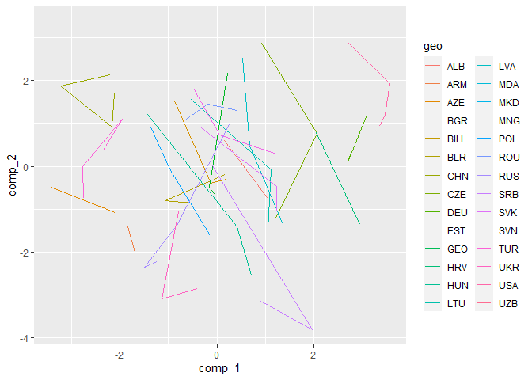

Regime-cluster
================
Granát Marcell
2022 02 14

``` r
library(tidyverse)
load("c:/rprojects/regime-cluster/data/wf_df.Rdata")
```

``` r
merged_df <- wv_df %>% 
  group_by(geo, time) %>% 
  nest() %>% 
  rbind(evs_df) %>% 
  arrange(geo, time) %>% 
  unnest() %>% 
  ungroup() %>% 
  mutate(
    time = case_when(
      time == 1 | time == 2 ~ "1", 
      time == 3 | time == 4 ~ "2",
      time == 5 | time == 6 ~ "3"
    )
  ) %>% 
    mutate(
    C001 = case_when(
      as.character(C001) == "1" ~ "1",
      as.character(C001) == "2" ~ "3",
      as.character(C001) == "3" ~ "2",
    ),
    C001 = as.numeric(C001)
  ) %>% 
  group_by(geo, time) %>% 
  summarise_all(mean, na.rm = TRUE) %>% 
  mutate_all(~ ifelse(is.na(.), NA, .)) %>% 
  select(where(~ sum(!is.na(.)) / length(.) > .5)) %>% 
  select(geo, time, A035, C001, F117, E025, E036, E037, E039, A124_02, E012, E069_17, E069_04) # TODO REMOVE IS UNRELEVANT

# Herfindex

herfindex_df <- rio::import("https://democracybarometerorg.files.wordpress.com/2020/09/db_data_2020_all_data_standardised.xlsx") %>% 
  tibble() %>% 
  select(geo = Country, time = Year, herfindex = Herfindex) %>% 
  mutate(geo = countrycode::countrycode(geo, "country.name", "iso3c"))

gms_df <- readxl::excel_sheets("c:/rprojects/regime-cluster/data/wgidataset.xlsx") %>% 
  .[-1] %>% 
  map(function(sheet_name) {
    readxl::read_excel("c:/rprojects/regime-cluster/data/wgidataset.xlsx", sheet = sheet_name, skip = 13) %>% 
      select(2, where(~ .[[1]] == "Estimate")) %>% 
      slice(-1) %>% 
      rename(geo = 1) %>% 
      rename_all(gsub, pattern = "\\..*", replacement = "") %>% 
      pivot_longer(-1, values_to = sheet_name, names_to = "time") %>% 
      mutate_at(3, as.numeric)
  }) %>% 
  reduce(full_join) %>% 
  janitor::clean_names() %>% 
  filter(geo %in% countries_to_clust | geo %in% countries_to_compare)

# FDI ------------------------------------------------------------------------------------

gdp_df <- rio::import("https://api.worldbank.org/v2/en/indicator/NY.GDP.MKTP.CD?downloadformat=excel", format = "xls") %>% 
  tibble() %>% 
  janitor::row_to_names(3) %>%
  select(geo = 2, 35:last_col()) %>% 
  pivot_longer(-1, names_to = "time", values_to = "gdp") %>% 
  mutate(gdp = as.numeric(gdp))
```

``` r
fdi_df <- readxl::read_excel("c:/rprojects/regime-cluster/data/API_BX.KLT.DINV.CD.WD_DS2_en_excel_v2_3469365.xls") %>% 
  janitor::row_to_names(3) %>% 
  select(geo = 2, 35:last_col()) %>% 
  pivot_longer(-1, names_to = "time", values_to = "fdi") %>% 
  mutate(fdi = as.numeric(fdi)) %>% 
  left_join(gdp_df) %>% 
  mutate(fdi_per_gdp = fdi / gdp)
```

``` r
names_v <- factor(names(merged_df), levels = names(merged_df))
colorise <- function(x, name = FALSE) {
  y <- factor(x, levels = names(merged_df), ordered = TRUE)
  if (name) {
    case_when(
      y <= "A124_09" ~ "substantive democracy",
      y <= "E117" ~ "procedular democracy",
      y <= "A042" ~ "intervention",
      y <= "A042" ~ "nationalism"
    )
  } else {
    case_when(
      y <= "A124_09" ~ "red4",
      y <= "E117" ~ "steelblue",
      y <= "A042" ~ "purple",
      T ~ "cyan4"
    )
  }
}
```

``` r
pca_df <- merged_df %>% 
  ungroup() %>% 
  {
    bind_cols(
      select(., 1:2),
      complete(mice::mice(select(., -1, -2)))
    )
  } %>% 
  mutate_at(-(1:2), scale)
```

    ## 
    ##  iter imp variable
    ##   1   1  A035  F117  E025  E036  A124_02  E012  E069_17
    ##   1   2  A035  F117  E025  E036  A124_02  E012  E069_17
    ##   1   3  A035  F117  E025  E036  A124_02  E012  E069_17
    ##   1   4  A035  F117  E025  E036  A124_02  E012  E069_17
    ##   1   5  A035  F117  E025  E036  A124_02  E012  E069_17
    ##   2   1  A035  F117  E025  E036  A124_02  E012  E069_17
    ##   2   2  A035  F117  E025  E036  A124_02  E012  E069_17
    ##   2   3  A035  F117  E025  E036  A124_02  E012  E069_17
    ##   2   4  A035  F117  E025  E036  A124_02  E012  E069_17
    ##   2   5  A035  F117  E025  E036  A124_02  E012  E069_17
    ##   3   1  A035  F117  E025  E036  A124_02  E012  E069_17
    ##   3   2  A035  F117  E025  E036  A124_02  E012  E069_17
    ##   3   3  A035  F117  E025  E036  A124_02  E012  E069_17
    ##   3   4  A035  F117  E025  E036  A124_02  E012  E069_17
    ##   3   5  A035  F117  E025  E036  A124_02  E012  E069_17
    ##   4   1  A035  F117  E025  E036  A124_02  E012  E069_17
    ##   4   2  A035  F117  E025  E036  A124_02  E012  E069_17
    ##   4   3  A035  F117  E025  E036  A124_02  E012  E069_17
    ##   4   4  A035  F117  E025  E036  A124_02  E012  E069_17
    ##   4   5  A035  F117  E025  E036  A124_02  E012  E069_17
    ##   5   1  A035  F117  E025  E036  A124_02  E012  E069_17
    ##   5   2  A035  F117  E025  E036  A124_02  E012  E069_17
    ##   5   3  A035  F117  E025  E036  A124_02  E012  E069_17
    ##   5   4  A035  F117  E025  E036  A124_02  E012  E069_17
    ##   5   5  A035  F117  E025  E036  A124_02  E012  E069_17

``` r
pca_fit <- pca_df %>% 
  select(-(1:2)) %>% 
  princomp()
```

``` r
pca_df %>% 
  select(1:2) %>% 
  bind_cols(data.frame(pca_fit$scores)) %>% 
  janitor::clean_names() %>% 
  ggplot() + 
  geom_path(aes(comp_1, comp_2, color = geo))
```

<!-- -->

``` r
pca_fit %>% 
  .$loadings %>% 
  unclass() %>% 
  data.frame() %>% 
  rownames_to_column() %>% 
  pivot_longer(-1) %>% 
  mutate(
    name = str_remove(name, 'Comp.'),
  ) %>% 
  filter(name %in% 1:3) %>% 
  mutate(
    name = factor(str_c('# ', name), levels = str_c('# ', 1:n_distinct(name))),
    rowname = factor(rowname, levels = names(merged_df), ordered = T)
  ) %>% 
  left_join(distinct(select(codenames_df, rowname = code, l = q))) %>%
  arrange(rowname) %>% 
  mutate(
    l = str_c(rowname, ": ", l),
    l = fct_inorder(l)
    ) %>% 
  ggplot +
  aes(l, value, fill = value < 0) +
  geom_hline(yintercept = 0) +
  geom_col(color = 'black') +
  coord_flip() +
  scale_fill_discrete(guide = F) +
  # scale_y_continuous(labels = scales::percent) +
  facet_wrap(~ name, ncol = 3) +
  labs(x = NULL, y = NULL, title = 'Főkomponensek')
```

<!-- -->

``` r
bind_cols(
  pca_df[c("geo", "time")],
  data.frame(pca_fit$scores)
) %>% 
  janitor::clean_names() %>% 
  slice_max(comp_2, n = 5) %>% 
  select(1:5)
```

    ## # A tibble: 5 x 5
    ##   geo   time  comp_1 comp_2  comp_3
    ##   <chr> <chr>  <dbl>  <dbl>   <dbl>
    ## 1 UZB   3     -3.10    3.38  2.27  
    ## 2 USA   1      2.70    2.89 -0.0447
    ## 3 CZE   1      0.927   2.87 -1.92  
    ## 4 LVA   1      0.535   2.53 -0.205 
    ## 5 EST   1      0.225   2.17 -0.536

``` r
factoextra::fviz_pca_biplot(pca_fit, col.ind = NA, 
                            col.var = pca_df %>% 
                              select(-1, -2) %>% 
                              names() %>% 
                              factor(levels = names(merged_df), ordered = T) %>% 
                              colorise()
) +
  geomtextpath::geom_labelpath(
    data = pca_df %>% 
      select(1:2) %>% 
      bind_cols(data.frame(pca_fit$scores)) %>% 
      janitor::clean_names(),
    mapping = aes(comp_1, comp_2, label = geo, group = geo), alpha = .5
  )
```

<!-- -->

``` r
ggsave(filename = "plot.svg")
```

``` r
pca_predictor <- pca_df %>% 
  select(1, 2) %>% 
  bind_cols(data.frame(pca_fit$scores)) %>% 
  janitor::clean_names() %>% 
  select(1:5) %>% 
  mutate(time = as.numeric(time))
```

``` r
df <- gms_df %>% 
  left_join(fdi_df) %>% 
  mutate(
    
  time = case_when(
    time > 1981 & time <= 1984 ~ 1,
    time > 1989 & time <= 1993 ~ 1,
    time > 1994 & time <= 1998 ~ 2,
    time > 1999 & time <= 2004 ~ 3,
    time > 2005 & time <= 2009 ~ 1,
    time > 2010 & time <= 2014 ~ 1,
  )
  ) %>% 
  select(geo, time, voiceand_accountability, regulatory_quality, controlof_corruption, fdi_per_gdp) %>% 
  left_join(pca_predictor) %>% 
  na.omit()
```

``` r
df %>% 
  lm(formula = voiceand_accountability ~ comp_1 + comp_2 + comp_3 + fdi_per_gdp) %>% 
  GGally::ggcoef_model() + 
  ggtitle("voiceand_accountability")
```

<!-- -->

``` r
df %>% 
  lm(formula = regulatory_quality ~ comp_1 + comp_2 + comp_3 + fdi_per_gdp) %>% 
  GGally::ggcoef_model() + 
  ggtitle("regulatory_quality")
```

<!-- -->

``` r
df %>% 
  lm(formula = controlof_corruption ~ comp_1 + comp_2 + comp_3 + fdi_per_gdp) %>% 
  GGally::ggcoef_model() + 
  ggtitle("controlof_corruption")
```

<!-- -->
